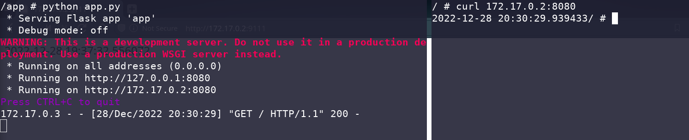

# Docker networking

To understand docker networking, it's necessary to know the host and guest network.

In my local environment, when I run `ip addr`:
```bash
1: lo: <LOOPBACK,UP,LOWER_UP> mtu 65536 qdisc noqueue state UNKNOWN group default qlen 1000
    link/loopback 00:00:00:00:00:00 brd 00:00:00:00:00:00
    inet 127.0.0.1/8 scope host lo
       valid_lft forever preferred_lft forever
    inet6 ::1/128 scope host 
       valid_lft forever preferred_lft forever
...
4: docker0: <NO-CARRIER,BROADCAST,MULTICAST,UP> mtu 1500 qdisc noqueue state DOWN group default 
    link/ether 02:42:46:d1:22:71 brd ff:ff:ff:ff:ff:ff
    inet 172.17.0.1/16 brd 172.17.255.255 scope global docker0
       valid_lft forever preferred_lft forever
    inet6 fe80::42:46ff:fed1:2271/64 scope link 
       valid_lft forever preferred_lft forever
...
```

There's one entry `docker0` on the network. This network can be considered as an inner circle within our entire network. It's ip address starts from `172.17.0.1`. It means whenever you want to access the docker container, it doesn't start like `127.0.0.*`. 

<++>
- default bridge network - by IP address
- user-defined bridge network - by container name as host name

## Docker network commands

`Usage:  docker network COMMAND`


### list the network - `docker network ls`

```bash
$ docker network ls

NETWORK ID     NAME      DRIVER    SCOPE
224d6cbb275b   bridge    bridge    local
b4c50088ab1b   host      host      local
0d8cf1187c9f   none      null      local
```

### default network is `bridge`

By default, every new container connects to `bridge` network.

```bash
# init a container, up and running
docker run --name mycontainer -it alpine
```

We can simply check the information about this container by `docker inspect <container_name>`. It will return a json, there's key `NetworkSettings` that contain the value of networking:
```json
[
    {
    // omit
        ...

        "NetworkSettings": {

            // ...

            "Networks": {
                "bridge": {
                    "IPAMConfig": null,
                    "Links": null,
                    "Aliases": null,
                    "NetworkID": "224d6cbb275be53e0e3b67919e28cc8b351429018e6cf82aab5a2ca11b208108",
                    "EndpointID": "44fd9ef5c1ffa7e224d40da62168e7e3c192cf56f52ff03179e2e36f6687f0ef",
                    "Gateway": "172.17.0.1",
                    "IPAddress": "172.17.0.2",
                    "IPPrefixLen": 16,
                    "IPv6Gateway": "",
            // ...
]
```

1. The `"Networks"` - first key is `bridge`. The default network.
2. The `Gateway` - it's the address we see in the host environment.
3. `IPAddress` - It's how we can access this container from outside. i.e. access it from host or another container, send request to `http://172.17.0.2`

### define a custom network

`$ docker network create <custom_name>`

Example:
```bash
docker network create my_net
```

And when we list the network
```
[derry@Man-x1 piplines]$ docker network ls
NETWORK ID     NAME      DRIVER    SCOPE
224d6cbb275b   bridge    bridge    local
b4c50088ab1b   host      host      local
d36c06807fad   my_net    bridge    local
0d8cf1187c9f   none      null      local
```

When you create different network, you run `docker network inspect`, you will see different address. For example, my machine:
- `bridge`:`172.17.0.2`
- `my_net`:`172.18.0.2`

Furthermore, we can run `ip addr` on the host machine, we can see a new network is created:
```
5: docker0: <NO-CARRIER,BROADCAST,MULTICAST,UP> mtu 1500 qdisc noqueue state DOWN group default 
    link/ether 02:42:10:7b:51:90 brd ff:ff:ff:ff:ff:ff
    inet 172.17.0.1/16 scope global docker0
       valid_lft forever preferred_lft forever

...

6: br-ddef12e98a69: <NO-CARRIER,BROADCAST,MULTICAST,UP> mtu 1500 qdisc noqueue state DOWN group default 
    link/ether 02:42:af:27:1c:3e brd ff:ff:ff:ff:ff:ff
    inet 172.18.0.1/16 scope global br-ddef12e98a69
       valid_lft forever preferred_lft forever
```

### Run multiple containers and make container talk to each other

Let different containers talk to each other is very simple **as long as they're on the same network.** 

You can either:
- when initialize a container, specify the network `docker run --name myapp --network <NETWORK> <IMAGE>`
- add the container to network by `docker network connect <NETWORK>`

For example, I set up 1 web server in container named `myflask`. Then I initialize another container, named questbox, and inside that container I send a request to `myflask`.

- `myflask` - a web server container
- `questbox` - a container that I use to send request to the other

Container `myflask`:
```bash
$ docker run --name myflask -it alpine    # a container, running webserver

...
 * Serving Flask app 'app'
 * Debug mode: off
WARNING: This is a development server. Do not use it in a production deployment. Use a production WSGI server instead.
 * Running on all addresses (0.0.0.0)
 * Running on http://127.0.0.1:8080
 * Running on http://172.17.0.2:8080
```

Container `questbox`:
```bash
$ docker run --name questbox -it alpine   # start the container

$ curl 172.17.0.2:8080
```

We will see the request message in `myFlask` and response in `questbox` terminal:

If you want to use a user-define network, simply connect the container to the network. It's done.
