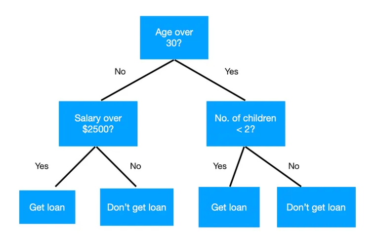
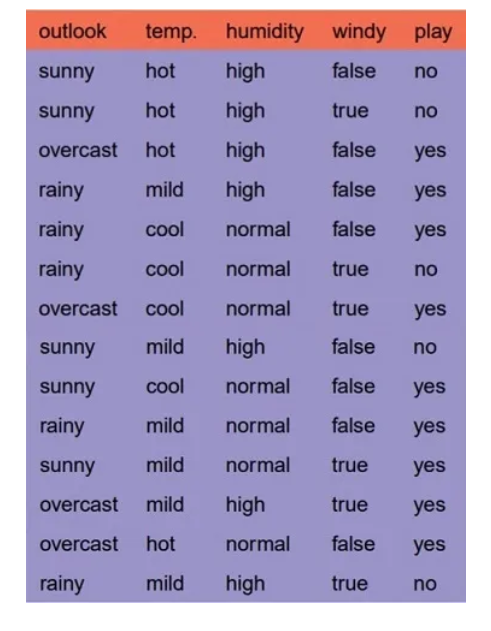
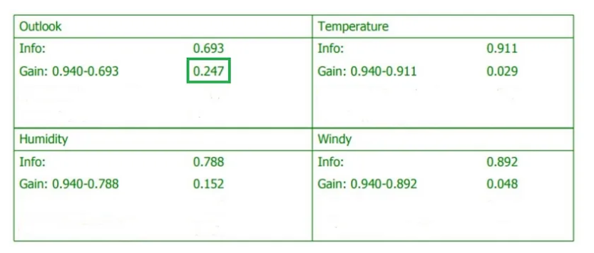
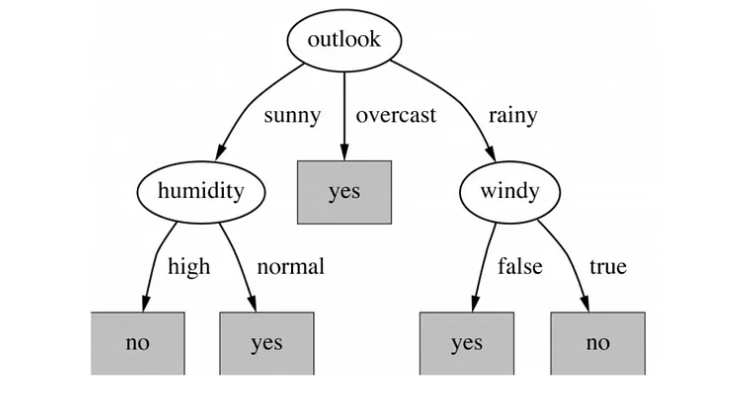

# Decision tree

> Decision tree is a supervised machine learning algorithm that can be used for classification and regression problems.

Advantages:
- Easy to interpret, easy to understand the split
- time required to make prediction is less
- No missing value imputation required

Disadvantages:
- Small change can lead to vast difference
- Prone to overfit to your training data

## Algorithms

Common ones: 
- ID3 (Iterative dichotomiser 3): use *entropy and information gain*
- C4.5 (sucessor of ID3)
- CART (classification and regression tree): use *Gini index*
- CHAID
- MARS

## ID3 and Entropy

> Entropy is a metric in physics for measuring the degree of disorder or randomness of a system.

Formula for calculating information entropy:
> $E = - \displaystyle \sum_{i=1}^{n} p_i * log_2 p_i$  

Entropy is based on the **probability** of some classes occurrence. 

For the decision tree, it can be thought as a measure of uncertainty with respect to prediction. 

---

### Entropy calculation example

Suppose we have a dataset with 2 classes: *dog and cat*. Randomly pick up a data, what's the probability of it being a dog?

10 animals: 3 dogs, 7 cats.

Entropy of the dataset:
$E = - (\frac{3}{10} \log_2 (\frac{3}{10}) + \frac{7}{10} \log_2(\frac{7}{10}))$
$E = - (\frac{3}{10} * (-0.575716) + \frac{7}{10} * (-1.9433))$ 
$E = - (- 1.533) = 1.533$ 

If the dataset only has dogs, then we can know any data we retrieve is 100% dog. The entropy will therefore be 0 in the dataset.

### Information Gain

> Great reduction in entropy means high information gain

Information gain = entropy(parent) - [avg entropy(children)]

### ID3 example: golf play

Our goal is to create a tree to classify to *play or not*.

#### Which feature do we pick? 

> Pick the feature with highest information gain, a.k.a minimize the entropy

4 features (x)
- outlook
- temp
- humidity
- windy

For 4 features, we calculate the entropy for each. We pick the one with highest information gain.

Here it shows that *outlook* feature has the highest information gain. So we split here.

**We keep on doing so until we reach the end.**

The end might be the number of depth you specify, or nodes you specify. Those are hyper-parameters you decide.

#### Final decision tree

Every splits, it chooses the one provides the highest information gain.

## CART and Gini index

This is explained in article 2. I think I will not use it anytime soon now. So I will skip it for now.

# source

[article 1](https://medium.com/analytics-vidhya/decision-trees-explained-in-simple-steps-39ee1a6b00a2)

[article 2](https://medium.com/deep-math-machine-learning-ai/chapter-4-decision-trees-algorithms-b93975f7a1f1)