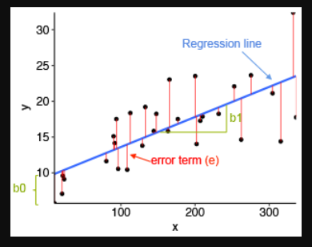
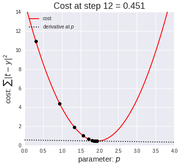

# Linear regression
Simplest form: $y = mx + b$

It is used to predict the **continuous data**.

> Linear regression is the supervised Machine Learning model in which that it finds the best fit linear lint between the *independent* ($x$) and *dependent* ($y$).

---

## Linear regression forms

There are 2 types: 
- Simple linear regression, 1 variable x: $y = mx + b$
- Multiple linear regression, many variables: $y = w_0 x_0 + w_1 x_1 + ... w_n x_n + b$ 

> The aim is to find the best fit linear line and the optimal values of *1. intercept (b)*, *2. coefficients (w)*, such that the error is minimized.

---

## What is error/residual in Linear regression?

> The error is the difference between the actual value and the predicted value. The goal is to reduce this difference.

- Blue line is our linear regression. 
- Black dot is the data point
- The difference is the distance between actual data and our line, here use the *red line*.

As you might guess, in this graph, it's impossible to reach a zero-error situation by a straight line. If you have a line that turns and match every point in this graph, you will might've faced the **over-fitting** issue.

The distance from one data to the line, is one error.

Then sum up every error to the line, we call it *sum of errors/residuals.*

Sum of errors:
$\Sigma (actual - predict) = \Sigma (errors)$ 

Most tend to prefer to square it, so:
$\Sigma (e)^2 = (Y_i - \hat{y})^2$ 

---

## Assumptions

### 1. Linearity 
> It suggests that $y$ will should depend on $x$ . 

### 2. Normality

> The $X$ and $Y$ should be normally distributed. 

### 3. Homo-scedasticity
> The variance of the errors should be constant, or very close in terms.

The graph below is what we going for.

### 4. Independence

> The variables should be independent to each other. No correlation should be present.

For example, when we predict the possibility of someone being hired, we should pay attention that besides:

- years of experience
- academic degree
- money the candidate has

We should pay attention to **money** factor here, because there might be a correlation of **money and the years of experience**.

We can use  heatmap to inspect such correlation. 

### 5. Errors should be normally distributed

> Errors should also be normally distributed

### 6. No auto-correlation

> The error terms should be independent of each other. Autocorrelation can be tested using the Durbin Watson test. The null hypothesis assumes that there is no autocorrelation. The value of the test lies between 0 to 4. If the value of the test is 2 then there is no autocorrelation.

## Evaluation metrics - How to measure error

- R square - most common. Values 0~1 : (worst) ~ (best). can be negative is the model is arbitrarily worse
- Adjusted R square (R2) - improved R square
- MAE (Mean absolute error) - average error of all dat 
- MSE (Mean squared error) - Another common one: $MAE^2$
- RMSE (Root MSE) - $\sqrt{MSE}$ 

### Gradient descent - approach to minimize error

source: mi-academy.com

>  Imagine ourselves at the top of a mountain valley and left stranded and blindfolded, our objective is to reach the bottom of the hill. Feeling the slope of the terrain around you is what everyone would do. Well, this action is analogous to calculating the gradient descent

Choose a learning rate is important for gradient descent. It decides how large each step will be during each iteration.

Imagine, you want to find the lowest point in the valley. What if you step is too large, that it crosses mountains? You'll never find the lowest point.

## What if the data is not look like a straight line?

Social media users:

Cancer cell, wild fire, etc. Those numbers are not linear. It usually grow exponentially. In such cases, we need to use *polynomial regression*.

# Multiple linear regression

What if the prediction is not only based on 1 variable?

$y = a*x_0 + b*x_1 + ... + n*x_k + constant$ 

# Further

- Multicollinearity: multiple features are correlated with each other
- Use PCA beforehead (aka PCR)

# Links

[Sklearn full models](https://scikit-learn.org/stable/modules/linear_model.html)

[source 2](https://towardsdatascience.com/introduction-to-linear-regression-and-polynomial-regression-f8adc96f31cb)